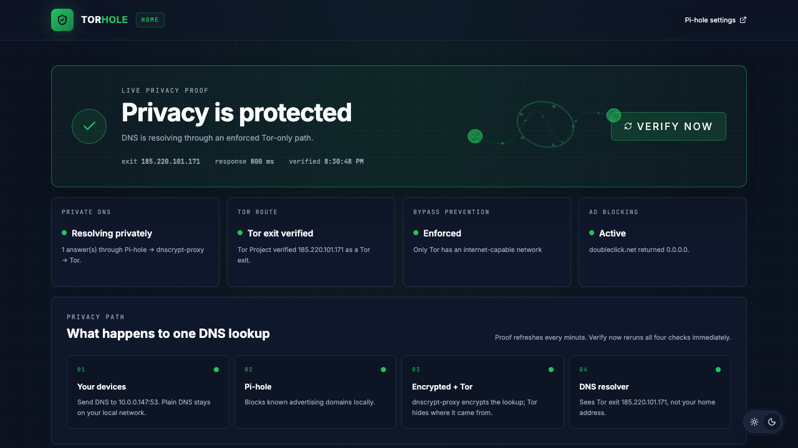
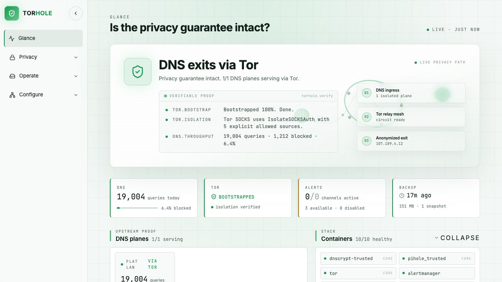

# Torhole

Torhole is a self-hosted DNS privacy gateway. It blocks unwanted domains with
Pi-hole, encrypts outbound DNS resolver connections with dnscrypt-proxy, and
sends those connections through Tor.

The purpose is specific: **obfuscate the origin and network path of upstream
DNS traffic**. The resolver receives the DNS question from a Tor exit instead
of directly from your household or office IP address.

## Torhole is not a VPN

Torhole deliberately protects the DNS path. It does not tunnel all traffic from
your devices.

- It does **not** route web, video, messaging, or application traffic through
  Tor.
- It does **not** replace your public IP address when you visit a website.
- It does **not** make browsing anonymous or make an unsafe device secure.
- It cannot protect DNS requests from an application that ignores your network
  DNS setting and uses its own resolver or encrypted-DNS service.

A conventional full-tunnel VPN changes the route for most or all device
traffic and moves trust to the VPN operator. Torhole makes a narrower change:
devices keep their normal Internet connection, while DNS handled by Torhole
takes a filtered, encrypted, Tor-routed path.

## What happens to a DNS lookup

```text
Your device
  -> Pi-hole                    filters domains and answers local DNS
  -> dnscrypt-proxy             encrypts the upstream resolver connection
  -> Tor circuit                separates the request from your public IP
  -> upstream DNS resolver      sees the query coming from a Tor exit
```

Your ordinary application traffic follows its normal route:

```text
Your browser or app -> your normal Internet connection -> destination service
```

Tor and encrypted DNS solve different parts of the problem:

- **Pi-hole** keeps filtering and local DNS under your control.
- **dnscrypt-proxy** protects the resolver traffic, including beyond the Tor
  exit, using DNSCrypt or HTTPS-based resolvers.
- **Tor** prevents the resolver from receiving the connection directly from
  your household public IP.

### Who can see what?

| Observer | What it can see |
|---|---|
| Your Torhole host | DNS questions, client information, and Pi-hole logs according to your settings |
| Your ISP or upstream network | A connection to the Tor network, but not the DNS payload carried inside it |
| A Tor exit relay | A connection to the selected resolver; the resolver protocol remains encrypted |
| The DNS resolver | The DNS question and the Tor exit address, not your household public IP |
| Websites and Internet services | Your normal public IP and application traffic, because Torhole is not a full-traffic tunnel |

This is DNS privacy through source obfuscation and transport encryption, not a
claim of complete anonymity. Tor usage can be identified as Tor usage, timing
analysis remains possible, and Pi-hole is still a DNS logging point that you
operate. Devices must actually use Torhole as their DNS server for this path to
apply.

## One product, two editions

Torhole has one repository, one installer, and one privacy core. During setup,
you choose a capability profile:

| | Torhole Home | Torhole Advanced |
|---|---|---|
| Designed for | Households and first-time self-hosters | Homelabs and operators who want full visibility/control, on flat or segmented networks |
| DNS layout | One simple DNS plane | One flat-LAN plane or separate Trusted/IoT VLAN planes |
| Privacy path | Pi-hole -> dnscrypt-proxy -> Tor | The same core path, with isolation for every active plane |
| User experience | Guided setup and a lightweight privacy dashboard | Guided setup plus the full operational workspace |
| Controls | Verify privacy, start, stop, restart, and renew Tor identity | Per-plane Tor controls, validation, recovery, and deeper operations |
| Optional operations | Intentionally minimal | SSO, Caddy, backups, Prometheus, Grafana, Loki, alerting, and container tooling |

### Why have two editions?

The DNS privacy mechanism should be usable without requiring knowledge of
VLANs, identity providers, metrics, or log aggregation. Home keeps the number
of components and decisions small, which makes installation, recovery, and
everyday use more approachable.

Advanced exists because long-running infrastructure may need more visibility,
control, recovery, and alerting whether the network is flat or segmented. VLANs
are an Advanced topology option, not the definition of the edition. Its
operational tools consume more resources and create more configuration surface,
so they should not be mandatory for someone who only wants a private DNS path.

These are not separate products or installers. Both use the same Torhole code
and guided setup. Start with Home unless you already know why you need the
Advanced capabilities.

<table>
<tr>
<td width="50%"><strong>Torhole Home</strong><br><sub>One clear privacy proof and safe everyday controls.</sub></td>
<td width="50%"><strong>Torhole Advanced</strong><br><sub>Live proof, topology, operations, monitoring, and recovery.</sub></td>
</tr>
<tr>
<td></td>
<td></td>
</tr>
</table>

### Light and dark themes

The Advanced workspace supports both appearances without changing the privacy
proof or operational controls.

<table>
<tr>
<td width="50%"><strong>Dark</strong></td>
<td width="50%"><strong>Light</strong></td>
</tr>
<tr>
<td></td>
<td></td>
</tr>
</table>

## Prepare a host

Torhole should run on a dedicated, always-on 64-bit Linux host connected to
your network by Ethernet. The values below are practical starting points, not
hard minimums:

| Profile | CPU | Memory | Storage | Network |
|---|---:|---:|---:|---|
| Home | 2 cores | 2 GB | 16 GB | One wired LAN interface |
| Advanced | 2 or more cores | 4 GB or more | 32 GB or more; SSD recommended | Wired interface plus VLAN-capable router/switch when using segmentation |

Before installation:

1. Give the host a DHCP reservation or static address. Other devices will use
   this address for DNS, so it must not change.
2. Confirm the host can reach the Internet and resolve `github.com`.
3. Make sure you have a user with `sudo` access.
4. Do not install another DNS server first. Existing Pi-hole, AdGuard Home,
   dnsmasq, or another service using port 53 will conflict with Torhole.
5. Keep the Torhole dashboard and administration ports on the trusted LAN; do
   not forward them from the public Internet.

### Raspberry Pi

A Raspberry Pi 5 with a proper power supply and wired Ethernet is the reference
small-device platform. Use Raspberry Pi Imager to install the current 64-bit
Raspberry Pi OS Lite. In Imager, set a hostname, create your user, enable SSH,
and add your SSH public key before writing the card. Raspberry Pi maintains the
[official Imager and OS installation guide](https://www.raspberrypi.com/documentation/computers/os.html).

A good-quality SD card is sufficient for Home. An SSD is preferable for
Advanced because metrics, logs, and backups create more sustained writes. Boot
the Pi, connect it by Ethernet, reserve its address in the router, then update
it before installing Torhole:

```bash
sudo apt update
sudo apt full-upgrade -y
sudo reboot
```

### Debian or Ubuntu virtual machine

Create a 64-bit Debian stable or Ubuntu Server LTS VM. Use a **bridged** network
adapter so routers and LAN devices can reach the VM directly; NAT-only
networking is usually unsuitable for a network DNS server. Assign the resources
from the table above, install the SSH server, and reserve the VM's address.

The maintained installation references are the
[Debian stable installer](https://www.debian.org/releases/stable/debian-installer/)
and the [Ubuntu Server installation guide](https://documentation.ubuntu.com/server/tutorial/basic-installation/).
Taking a clean VM snapshot after the OS is updated, but before running Torhole,
makes repeated installation testing and recovery straightforward.

### Mini PC or repurposed computer

Install 64-bit Debian stable or Ubuntu Server LTS directly on the machine. A
small Intel or AMD mini PC with wired Ethernet makes a strong Advanced host;
the same preparation as a VM applies, except its network interface is already
on the physical LAN. Back up anything important before replacing an existing
operating system, use an SSD when possible, enable SSH, update the OS, and give
the machine a reserved address.

For Advanced VLAN isolation, the physical NIC, switch port, and router must all
support the intended tagged VLANs. If that sentence is unfamiliar, start with
Home or choose **Advanced → Single-LAN**. VLANs are not required for either the
DNS privacy path or Advanced operational tooling.

## Install

Torhole is intended for a Raspberry Pi 5 or a Debian/Ubuntu host or VM. Docker
Engine and Docker Compose are required; on Debian and Ubuntu the installer can
install them after asking for permission.

Run:

```bash
curl -fsSL https://raw.githubusercontent.com/torhole/torhole/main/get-torhole.sh | bash
```

The bootstrap:

1. installs Git if it is missing and you approve the change;
2. downloads Torhole into `~/torhole`;
3. requests one operating-system `sudo` authorization for host installation;
4. starts a temporary local setup service and a narrow host-side installer;
5. opens or prints a private setup URL;
6. lets you choose **Home** or **Advanced**, configure it, install it, and watch
   progress in the browser.

Keep the launcher terminal open until the web wizard reports success. Closing
the setup page with its Finish button removes the temporary bootstrap service.

The wizard writes deployment-specific values to local, ignored environment
files. They are not committed to the repository.

To inspect the bootstrap before running it:

```bash
curl -fsSLO https://raw.githubusercontent.com/torhole/torhole/main/get-torhole.sh
less get-torhole.sh
bash get-torhole.sh
```

The traditional clone workflow starts the same installer:

```bash
git clone https://github.com/torhole/torhole.git
cd torhole
./install.sh
```

To install a specific stable release instead of the moving `main` branch:

```bash
curl -fsSL https://raw.githubusercontent.com/torhole/torhole/v0.2.1/get-torhole.sh \
  | TORHOLE_REF=v0.2.1 bash
```

Published release archives include SHA-256 checksums and signed build
provenance. See [release integrity](pi-dns-warden/docs/release-integrity.md)
for verification commands.

### Home setup

Choose **Home** in the web installer. Home creates a secure local configuration,
starts one Pi-hole/dnscrypt/Tor path, and shows the Torhole Home dashboard. The
installer prints:

- the Torhole dashboard address;
- the Pi-hole administration address and password;
- the DNS address to configure in your router or device.

The Blocklists step is an actual installer choice. Select one or more curated
sources; Torhole enables that exact selection, refreshes Pi-hole gravity, and
keeps Pi-hole's database in a persistent Docker volume. Lists added later in
Pi-hole are not removed by the Torhole installer.

After the stack starts, allow Tor a minute to establish a circuit. The Home
dashboard then verifies DNS resolution, blocking, Tor routing, the current exit,
and whether the resolver sees the Tor exit rather than the host's normal public
address.

The installer runs its own DNS check inside the Pi-hole container, so `dig` is
not a host prerequisite. To repeat the check without installing another Debian
package, run:

```bash
sudo docker exec torhole-qs-pihole dig @127.0.0.1 example.com
sudo docker exec torhole-qs-pihole dig @127.0.0.1 doubleclick.net
```

Omit `sudo` if your account can already access Docker. The first query should
resolve. The second should return a blocked response after the Pi-hole lists
are ready.

To test from another LAN device instead, install that device's DNS utilities
if needed (`sudo apt install dnsutils` on Debian/Ubuntu), then query the
**DNS server address shown by the installer**, not `127.0.0.1`:

```bash
dig @<torhole-dns-address> example.com
```

> **Port 53 already in use?** Torhole needs port 53 to serve ordinary routers
> and devices. Stop the conflicting DNS service, then run the installer again.
> Advanced users can change `DNS_PORT` in
> `pi-dns-warden/.env.quickstart.local` for testing, but most routers cannot use
> a custom DNS port.

### Advanced setup

Choose **Advanced** in the same web installer, then select the topology
independently:

- **Single-LAN:** one flat-network Pi-hole/dnscrypt plane plus the complete
  Advanced operations stack—SSO, Grafana, Prometheus, Loki, alerting, backups,
  validation, and service controls. No VLAN interfaces are created.
- **Segmented VLANs:** separate Trusted and IoT Pi-hole/dnscrypt planes plus the
  same Advanced operations stack. This requires correctly configured router,
  switch, and host VLAN settings.

Home and Advanced Single-LAN are therefore not the same deployment. They share
one DNS topology, but Advanced adds the operational capability set and its
additional resource/configuration cost.

The Advanced wizard also asks how the administration page should open:

- **HTTP:** immediate access by IP or local name on a trusted LAN;
- **HTTPS · generated:** Torhole creates a local certificate and offers its CA
  certificate for download on the final screen;
- **HTTPS · custom:** upload a PEM certificate and its matching private key.

Every Advanced mode keeps a password-protected recovery/configuration URL at
`http://<host-management-ip>/`. DNS or certificate mistakes therefore do not
lock the administrator out of Torhole.

After validation, the wizard writes `pi-dns-warden/.env` with mode `0600`,
generates any missing local credentials, and queues Torhole's fixed Advanced
deployer through the launcher process that received `sudo` authorization before
the browser opened. The page streams deployment logs and does not report
success until the deployer exits successfully. No command needs to be copied
from the browser or run in a second terminal.

Advanced installs host systemd services. VLAN topology also creates host VLAN
interfaces; keep console access available during that first installation
because an incorrect interface, VLAN, or gateway can interrupt connectivity.

After installation, administrators can edit non-secret `.env` values one key at
a time under **Configure → App parameters**, or edit `pi-dns-warden/.env`
directly. Web edits are atomic and create a backup. Secrets remain masked and
use dedicated controls such as the admin-password editor. Saving a parameter
does not claim it is live: host networking, rendered authentication, and most
container changes still require a maintenance deployment.

Advanced can provide:

- a flat-LAN DNS plane or Trusted/IoT VLAN DNS isolation;
- the full Torhole administration workspace;
- Caddy and Authelia single sign-on;
- Prometheus metrics, Grafana dashboards, Loki logs, and alerting;
- protected backup and recovery operations;
- detailed Tor circuits, per-plane identity renewal, leak tests, and service
  controls.

These features are optional capability choices, not a different privacy model.
See [the detailed deployment reference](pi-dns-warden/docs/deploy-reference.md),
[Ansible notes](README-ANSIBLE.md), and [Proxmox notes](README-PROXMOX.md).

## Dashboard: proof, not a promise

Torhole is meant to show evidence that the configured DNS privacy path is
working. Depending on the selected edition, the dashboard presents:

- DNS resolution and blocking results;
- the observed Tor exit address;
- a comparison between the normal host address and the resolver path;
- live Tor circuit and relay details;
- a fail-closed or bypass result;
- start, stop, restart, verification, and Tor identity controls;
- service health and, in Advanced, operational metrics and alerts.

The dashboard proves the Torhole DNS path at that moment. It does not claim
that unrelated application traffic is using Tor.

## Operations

From the repository directory:

```bash
./install.sh status         # show Home service health
./install.sh logs           # follow Home logs
./install.sh stop           # stop Home without deleting configuration
./install.sh close-wizard   # close the temporary setup service
```

Advanced operations and validation commands are documented under
[`pi-dns-warden/docs/`](pi-dns-warden/docs/).

## Update Torhole

Updates keep the edition, topology, passwords, certificates, Pi-hole data, and
other local configuration selected during setup. You do **not** need to run the
setup wizard again for a normal update.

Before updating, make sure the current dashboard is healthy and avoid changing
router DNS settings until the update has completed. From the Torhole host:

```bash
cd ~/torhole
curl -fsSL https://raw.githubusercontent.com/torhole/torhole/main/get-torhole.sh \
  | TORHOLE_DOWNLOAD_ONLY=1 bash
```

The downloader accepts only a fast-forward update from the official Torhole
repository. It refuses to overwrite an unrelated directory or local Git
history.

Then apply the downloaded version for the installed edition.

For **Torhole Home**:

```bash
cd ~/torhole
./install.sh install-home
```

For **Torhole Advanced**:

```bash
cd ~/torhole/pi-dns-warden
sudo ./ops/scripts/40-update.sh
```

The Advanced updater validates the rendered configuration and creates a backup
before replacing running containers. Home rebuilds its containers while
retaining the persistent Pi-hole and Tor volumes. When the command finishes,
open Torhole and run the privacy verification again.

If an update fails, do not point clients at another resolver merely to make DNS
work: that would bypass Torhole's privacy path. Inspect the logs first, or
restore the previous Advanced snapshot from **Operate → Backups**.

## Remove or uninstall Torhole

Before removing Torhole, change the DNS server in your router or DHCP settings
away from the Torhole address. Otherwise clients may lose DNS as soon as the
containers stop.

### Stop it temporarily

For Home, the following command stops Torhole but keeps all configuration and
Pi-hole data:

```bash
cd ~/torhole
./install.sh stop
```

For Advanced, stop its system service:

```bash
sudo systemctl stop pihole-tor.service
```

Use this option when troubleshooting, moving the host, or when you may want to
start Torhole again.

### Remove running services but keep data

This removes the containers and Docker networks while retaining local
configuration and persistent data for a future reinstall.

For Home:

```bash
cd ~/torhole/pi-dns-warden
sudo docker compose --env-file .env.quickstart.local \
  -f docker-compose.quickstart.yml down
```

For Advanced:

```bash
sudo systemctl disable --now pihole-tor.service \
  pihole-tor-prometheus-watchdog.timer pihole-tor-vlans.service
cd ~/torhole/pi-dns-warden
sudo docker compose -f docker-compose.yml -f docker-compose.monitoring.yml down
```

The repository and its ignored local files remain the recovery copy. Do not
delete it unless you have intentionally chosen the permanent-removal path.

### Permanently remove all data

Permanent removal also means deleting Pi-hole history and settings, Tor state,
monitoring databases, backups, generated credentials, and local certificates.
This cannot be undone without an external backup.

Torhole does not yet advertise a one-command purge because Advanced installs
host services and can create VLAN interfaces as well as Docker resources. A
safe uninstaller must identify exactly what this installation owns before
deleting it. Until that command is implemented and tested, use the detailed
[uninstall checklist](pi-dns-warden/docs/uninstall.md) rather than improvising
with broad Docker-volume or recursive-delete commands.

## Routine maintenance and recovery

- View generated URLs, the control PIN, and local passwords with
  `./install.sh credentials`. Keep the output private.
- Check Home containers with `./install.sh status` and follow their logs with
  `./install.sh logs`.
- In Advanced, use **Glance** for current health, **Privacy** for the live proof,
  and **Operate → Stack validation** after configuration changes.
- Create an Advanced snapshot under **Operate → Backups** before changing
  networking, certificates, authentication, or topology.
- Keep the host operating system and Docker security updates current, but avoid
  unattended major distribution upgrades on a DNS server.
- Test DNS and the Tor exit after router, firewall, VLAN, or certificate
  changes. A green container status alone does not prove the complete privacy
  path.
- Keep the permanent Advanced recovery address
  `http://<host-management-ip>/` on the trusted LAN. It remains useful when
  local DNS, HTTPS, or SSO configuration is broken.

### Update Torhole containers

Updates require shell access to the Torhole host and `sudo`. Take a VM or host
backup first; Advanced users should also create a snapshot under **Operate →
Backups**. Updating downloads newer images for the configured tags, rebuilds
Torhole's local images, and recreates only containers whose image or
configuration changed. Persistent Docker volumes are retained.

For Home:

```bash
cd ~/torhole
git pull --ff-only
cd pi-dns-warden
sudo docker compose --env-file .env.quickstart.local \
  -f docker-compose.quickstart.yml pull --ignore-buildable
sudo docker compose --env-file .env.quickstart.local \
  -f docker-compose.quickstart.yml up -d --build
cd ..
./install.sh status
```

Then open the Home dashboard and run **Verify privacy**.

For Advanced, the deployment script is the supported updater because it also
renders configuration, rebuilds the local images, validates the stack, and
verifies that DNS still exits through Tor:

```bash
cd ~/torhole
git pull --ff-only
cd pi-dns-warden
sudo ./deploy.sh --skip-prereqs
```

Do not treat Dockhand's image-status banner as proof that images are current.
Dockhand is deliberately isolated from public registries, so registry checks
can report `Could not query registry` even though host-side Docker Compose
pulls work normally. A failed check means the image status is unknown, not
that the image is current.

## Repository layout

- `install.sh` and `get-torhole.sh` - the single guided installation entrypoint
- `pi-dns-warden/` - DNS, Tor, dashboards, monitoring, and operational services
- `ansible/` - optional Advanced provisioning
- `scripts/` - repository-level bootstrap and validation helpers
- `README-ALERTING.md`, `README-ANSIBLE.md`, `README-PROXMOX.md`, and
  `README-TESTING.md` - focused operator documentation

## Built with Codex during OpenAI Build Week

Torhole's public release, unified Home/Advanced installer, operational UI,
privacy-aware monitoring audit, and live deployment validation were completed
with Codex and GPT-5.6 during the Build Week submission period. The human
operator set the privacy boundary, product direction, topology requirements,
and release decisions; Codex accelerated repository-wide implementation,
testing, dashboard analysis, live VM diagnosis, documentation, and release
verification.

See [BUILD_WEEK.md](BUILD_WEEK.md) for the dated work breakdown, collaboration
details, verification evidence, and what should be considered new for judging.

## Security

Keep Torhole administration interfaces on a trusted network. Do not commit
generated environment files, certificates, keys, backups, query databases, or
deployment inventories.

Report vulnerabilities privately as described in [SECURITY.md](SECURITY.md).
