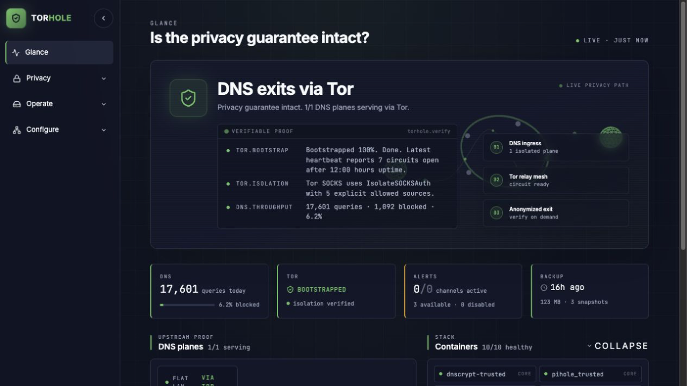
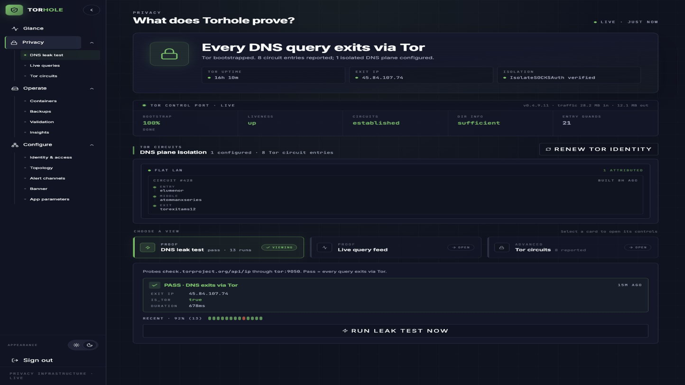
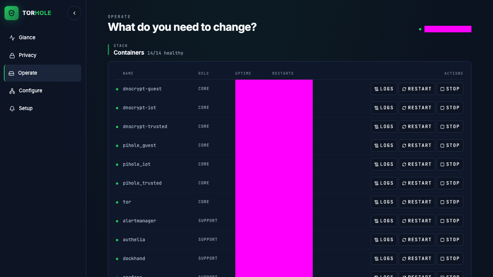
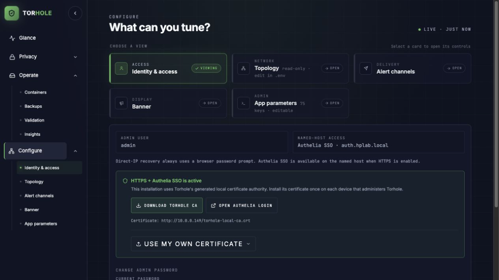
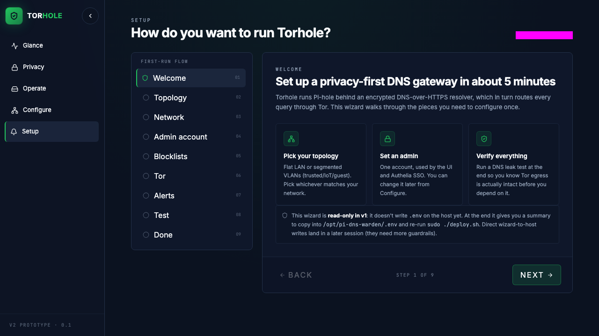

# Torhole

> **A privacy-first DNS gateway that proves its claims.** Pi-hole blocking + dnscrypt-proxy encryption + Tor exit — with a modern admin UI that renders the privacy guarantee live, instead of just asserting it.

<p align="center">
  
</p>

<p align="center">
  <em>Every DNS query on your network exits via Tor. Torhole shows you the proof.</em>
</p>

---

## Why

Every DNS query your devices make is a small leak of your intent. Which sites you visit, which IoT devices phone home, which ads are about to be shown. Your ISP sees it. Your upstream resolver sees it. Cloudflare, Google, Quad9 — they all promise not to log, but *promise* is all you have.

Torhole takes a different stance: **don't trust promises, verify topology**. Every query runs through a Pi-hole (for blocking), then through a dnscrypt-proxy (for encryption), then through Tor (so the upstream resolver can't see who you are). The admin UI shows you the exact Tor relay each plane is exiting through, runs live leak tests, and streams the current DNS activity as it happens.

If you can read the proof, you don't have to trust the marketing.

## Features

- **Every query exits via Tor.** Pi-hole → dnscrypt-proxy → tor:9050 → exit relay. Network isolation enforced at the Docker level — there is no route that bypasses the privacy stack.
- **Per-plane circuit isolation.** Each VLAN (or each logical plane) uses its own Tor SOCKS auth, so Trusted / IoT traffic never shares a circuit.
- **Live proof, not badges.** The Privacy screen shows real Tor relay fingerprints, runs a DNS leak test against check.torproject.org on demand, and streams live DNS queries as they flow through each Pi-hole.
- **Modern admin UI.** Five screens — Glance, Privacy, Operate, Configure, Setup — built with React 19 + Vite + Tailwind v4. No third-party CDN fetches from the admin UI; fonts are self-hosted.
- **Authelia SSO** in front of every admin surface (Grafana, Prometheus, Alertmanager, Pi-hole admin, the Torhole UI itself).
- **Backup and restore** with type-to-confirm safety gates for destructive operations.
- **Monitoring stack** included: Prometheus + Grafana (with auto-provisioned dashboards) + Loki + Alloy + Alertmanager + blackbox-exporter + node-exporter + cAdvisor.
- **End-to-end tests.** Playwright suite covers all 5 screens, interactive action flows, and visual regression (28 tests, ~22s).
- **Single-LAN or VLAN** topology. The Setup wizard picks the right default for you.

## Screens

<table>
<tr>
<td width="50%">

**Glance** — *Is the privacy guarantee intact right now?*


</td>
<td width="50%">

**Privacy** — *What does Torhole prove, and how?*



</td>
</tr>
<tr>
<td width="50%">

**Operate** — *What button do I press to fix or change something?*



</td>
<td width="50%">

**Configure** — *Where do I set the things I'm allowed to set?*



</td>
</tr>
<tr>
<td colspan="2">

**Setup** — *How do you want to run Torhole?* (First-run wizard, 9 steps)



</td>
</tr>
</table>

## Architecture

```
                       ┌────────────────────────────────────┐
                       │           internal bridge          │
                       │      pi-dns-warden_dns_int         │
                       │      (no gateway, no egress)       │
   ┌─────────────┐     │  ┌──────────┐     ┌────────────┐   │     ┌───────────┐
   │  clients    │──▶  │  │ pihole   │───▶ │ dnscrypt-* │───┼───▶ │    tor    │ ──▶ exit relay
   │  on LAN /   │     │  │ (block)  │     │ (encrypt)  │   │     │ (SOCKS5)  │
   │   VLANs     │     │  └──────────┘     └────────────┘   │     └───────────┘
   └─────────────┘     │                                    │           │
                       └────────────────────────────────────┘           ▼
                                                                tor_out bridge
                                                              (only egress path)
```

- `dns_int` is an **internal** Docker bridge. `dnscrypt-*` containers are attached only to `dns_int`, so they have no route to the internet.
- `tor` is the only container with a route out: it's attached to both `dns_int` and `tor_out`.
- **Topology is the proof.** Stopping the `tor` container kills DNS resolution for everyone. There is no bypass, not even under DNS-failover pressure — the stack just fails closed.

See [`docs/architecture.md`](docs/architecture.md) for the longer version and [`docs/privacy-model.md`](docs/privacy-model.md) for what Torhole does and does not protect against.

## Quick start

### Requirements

- Raspberry Pi 5 (tested) or any x86/arm64 Debian 12+ host
- Docker 24+ with the compose plugin
- ~2 GB free memory, ~10 GB free disk
- One free host-management IP. The wizard can use HTTP, generate local HTTPS,
  or accept your PEM certificate and private key.

### Install

```bash
git clone https://github.com/<you>/torhole.git
cd torhole
```

First run creates a `.env` from the example and stops so you can edit it:

```bash
chmod +x deploy.sh ops/scripts/*.sh
sudo ./deploy.sh
```

Edit `.env` — at minimum set:

- `TORHOLE_ADMIN_USER` and `TORHOLE_ADMIN_PASSWORD` (the Authelia admin)
- `PIHOLE_*_PASSWORD` for each plane
- `PIHOLE_*_IP` for each plane (the static IP clients will use as their DNS)
- `REVERSE_PROXY_DOMAIN` (for example, `lan.home.arpa`; bare `home.arpa` is not a valid Authelia cookie domain)
- `TORHOLE_WEB_MODE` (`http`, `https-local`, or `https-custom`)

Then run deploy again:

```bash
sudo ./deploy.sh
```

### First login

- Open the URL printed by the deployer, or use the permanent recovery URL
  `http://<host-management-ip>/`
- Log in with the admin credentials you set in `.env`
- The Setup wizard under `/v2/#/setup` walks you through the rest

### Verify

From any LAN client (not the Pi itself — macvlan hairpin won't let the Pi dig its own Pi-hole IP):

```bash
dig @<pi-hole-ip> example.com          # should return an A record
dig @<pi-hole-ip> doubleclick.net      # should return 0.0.0.0 (gravity blocked)
```

Then open the **Privacy** screen and click **run leak test now**. It should return a green `PASS · DNS exits via Tor` with a Tor exit IP within ~500ms.

## Topology options

Torhole supports two network layouts. The Setup wizard auto-detects which one you're running.

| Topology | Good for | What you need |
|---|---|---|
| **Single LAN** *(recommended)* | Home, or Advanced with the full SSO/monitoring/alerting/backup stack on one flat DNS plane. | A flat network and a static IP for the Pi-hole. Works on any home router. |
| **Segmented VLANs** | Advanced with Trusted / IoT separation. Each plane gets its own isolated Tor circuit pool. | Managed switch + VLAN-aware router (UniFi, OPNsense, etc.) |

For VLAN-mode operators, see [`docs/deploy-reference.md`](docs/deploy-reference.md) for the UniFi-specific setup notes.

## Admin surfaces

After deploy, the scheme is the wizard selection (`http` or `https`). HTTPS
uses Authelia SSO; HTTP and the permanent IP recovery page use the same Torhole
admin credentials directly at Caddy.

| URL | What |
|---|---|
| `<scheme>://th-torhole.<domain>/v2/` | The Torhole admin UI (5 screens) |
| `<scheme>://th-grafana.<domain>` | Grafana (Prometheus datasource, auto-provisioned dashboards) |
| `<scheme>://th-prometheus.<domain>` | Prometheus web UI |
| `<scheme>://th-alertmanager.<domain>` | Alertmanager web UI |
| `<scheme>://th-pihole-trusted.<domain>/admin/` | Pi-hole admin, per plane |
| `http://<host-management-ip>/` | Permanent password-protected recovery/configuration access |

One sign-in session covers all of them.

## Development

The admin UI is in [`monitoring/torhole-ui-v2/`](monitoring/torhole-ui-v2/).

```bash
cd monitoring/torhole-ui-v2
npm install
npm run dev      # vite dev server on http://localhost:5173
npm run build    # build to monitoring/caddy/v2/
```

### Tests

Playwright E2E suite — runs against a live Torhole instance:

```bash
cp tests/.env.test.example tests/.env.test
# fill in TORHOLE_BASE_URL and TORHOLE_TEST_USER / TORHOLE_TEST_PASSWORD
npm run test:e2e:install    # one-time chromium install (to project-local path)
npm run test:e2e            # full suite (~22s)
npm run test:e2e:ui         # Playwright UI mode for debugging
```

Covers 28 tests across 6 spec files:

- `glance.spec.ts` — hero, container counts, plane counts, proof tiles
- `privacy.spec.ts` — hero, circuit panel, leak test panel, live query feed
- `operate.spec.ts` — containers table, backups section, validation
- `configure.spec.ts` — all four sections, VLAN cards, toggles
- `setup.spec.ts` — stepper rail, back/next navigation, topology picker
- `actions.spec.ts` — rotate Tor identity, run DNS leak test
- `visual.spec.ts` — screenshot diff per screen (baselines in `tests/visual.spec.ts-snapshots/`)

### Contributing

Issues and PRs welcome. Before submitting a PR:

1. Run `npm run build` in `monitoring/torhole-ui-v2` — it must be clean
2. Run `npm run test:e2e` — all tests must pass
3. For destructive operations, use the `ConfirmModal` type-to-confirm gate — see [`docs/admin-redesign.md`](docs/admin-redesign.md) §4.3 for the rule

## Documentation

| Doc | What |
|---|---|
| [`docs/architecture.md`](docs/architecture.md) | How the pieces fit together (containers, networks, admin UI, Grafana dashboards) |
| [`docs/privacy-model.md`](docs/privacy-model.md) | What Torhole protects against (and doesn't) |
| [`docs/resolvers.md`](docs/resolvers.md) | dnscrypt-proxy resolver selection |
| [`docs/admin-redesign.md`](docs/admin-redesign.md) | Design rationale for the v2 admin UI |
| [`docs/deploy-reference.md`](docs/deploy-reference.md) | Full operator manual (VLAN setup, hardening, systemd units) |
| [`docs/demo-gif-recording.md`](docs/demo-gif-recording.md) | How to record the README walkthrough GIF |
| [`docs/self-hosted-runner.md`](docs/self-hosted-runner.md) | Wire a self-hosted GitHub runner for Playwright E2E (optional) |
| [`CONTRIBUTING.md`](CONTRIBUTING.md) | Dev setup, UI build + tests, CI overview, commit style |

## Project layout

```
torhole/
├── deploy.sh                       # one-shot install / upgrade
├── docker-compose.yml              # core DNS stack (tor, dnscrypt, pihole)
├── docker-compose.monitoring.yml   # monitoring + reverse proxy + authelia
├── .env.example                    # copy to .env and edit
├── tor/torrc                       # Tor config (SocksPort + ControlPort)
├── dnscrypt/{trusted,iot}/         # per-plane dnscrypt-proxy config
├── pihole/{trusted,iot}/           # per-plane Pi-hole data
├── ops/
│   ├── scripts/                    # prereqs, render, validate, backup, restore
│   └── systemd/                    # autostart units
├── monitoring/
│   ├── prometheus/                 # scrape config + alert rules
│   ├── alertmanager/               # rendered from .env by ops/scripts/17-render-alertmanager.sh
│   ├── grafana/                    # auto-provisioned dashboards
│   ├── loki/ alloy/ blackbox/      # logs + health probes
│   ├── authelia/                   # rendered from .env by ops/scripts/18-render-auth.sh
│   ├── caddy/                      # reverse proxy
│   ├── backup-manager/             # recovery API (server.py)
│   ├── torhole-ui/                 # legacy admin UI (will be removed)
│   └── torhole-ui-v2/              # current admin UI (Vite + React 19 + Tailwind 4)
└── docs/                           # see above
```

## Privacy scope

Torhole protects **DNS queries** — the names your devices look up. It does not:

- Hide the IP addresses of the sites you connect to after the DNS lookup (use a VPN or Tor Browser for that)
- Prevent browser/app telemetry that uses hardcoded IPs instead of DNS
- Protect against an attacker who has already compromised the host running Torhole

It does, provably:

- Stop your ISP from seeing which domains you resolve
- Stop your upstream resolver from building a profile of your DNS activity
- Block ads/trackers/malware at the DNS layer (Pi-hole)
- Fail closed: if Tor stops, DNS stops. No silent fallback to your ISP's resolver.

See [`docs/privacy-model.md`](docs/privacy-model.md) for the full threat model.

## License

GPL-3.0 — see [`LICENSE`](LICENSE).

Torhole is copyleft software: you're free to use, modify, and redistribute it,
but if you ship modifications you must share them under the same license.

---

<p align="center">
  <em>If Torhole helps you, star the repo. If it breaks, open an issue.</em>
</p>
